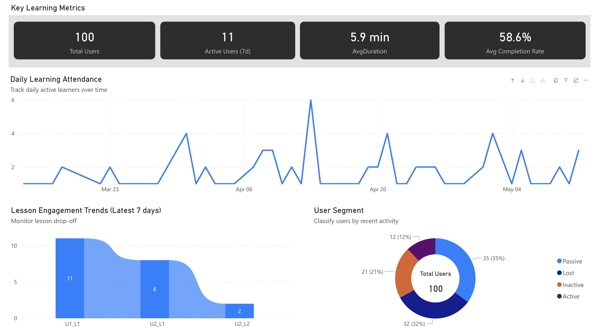
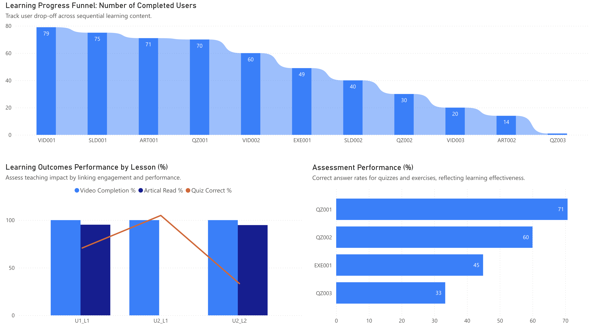

# 🎓 EdTech Analytics Pipeline Project

This project simulates a complete **data engineering and analytics pipeline** for an EdTech platform. It spans from student activity simulation to real-time streaming, data modeling, and dashboard visualization, designed to support education-focused product and operations teams.

---

## Project Overview

The pipeline includes:

1. **Data Definition** — Design schema, content structure, and event logic based on course products.
2. **Data Simulation** — Simulate realistic student interactions (video views, quiz attempts, etc.) using Python.
3. **Real-Time Streaming** — Send events via Kafka, buffer in a topic, and stream into Snowflake.
4. **Data Modeling with dbt** — Transform raw JSON into clean, structured, and queryable models.
5. **Visualization** — Build Power BI dashboards to deliver insights to different teams.

### Overview process

---

## Tech Stack

| Layer         | Tools Used         |
| ------------- | ------------------ |
| Simulation    | Python, Faker      |
| Messaging     | Kafka (via Docker) |
| Storage       | Snowflake          |
| Modeling      | dbt                |
| Visualization | Power BI           |
| Cloud Infra   | AWS EC2            |

---

## Key Modules & Directories

| Module                                          | Description                                                               |
| ----------------------------------------------- | ------------------------------------------------------------------------- |
| [`data-definition`](./data-definition/)         | Defines course structure, event types, data dictionary, and JSON schemas. |
| [`data-simulation`](./data-simulation/)         | Python-based simulator generating realistic student events using Faker.   |
| [`kafka-setup`](./kafka-setup/)                 | Docker-based Kafka + Zookeeper + Kafka UI setup for real-time streaming.  |
| [`snowflake-ingestion`](./snowflake-ingestion/) | Kafka consumer script writing events into Snowflake raw tables.           |
| [`dbt-models`](./dbt-models/)                   | dbt models transforming raw JSON into clean, analysis-ready fact tables.  |
| [`powerbi-dashboard`](./powerbi-dashboard/)     | Power BI visuals, report pages, and `.pbix` source file.                  |

---

## Dashboards

The Power BI report contains 4 pages:

1. **Overview** — Key metrics, activity trends, and user segments

3. **Learning Engagement** — Lesson completion, content type performance

5. **Content Performance** — Learning funnels, outcome-linked metrics

7. **User Segmentation** — Profiles by grade, gender, behavior, and location

