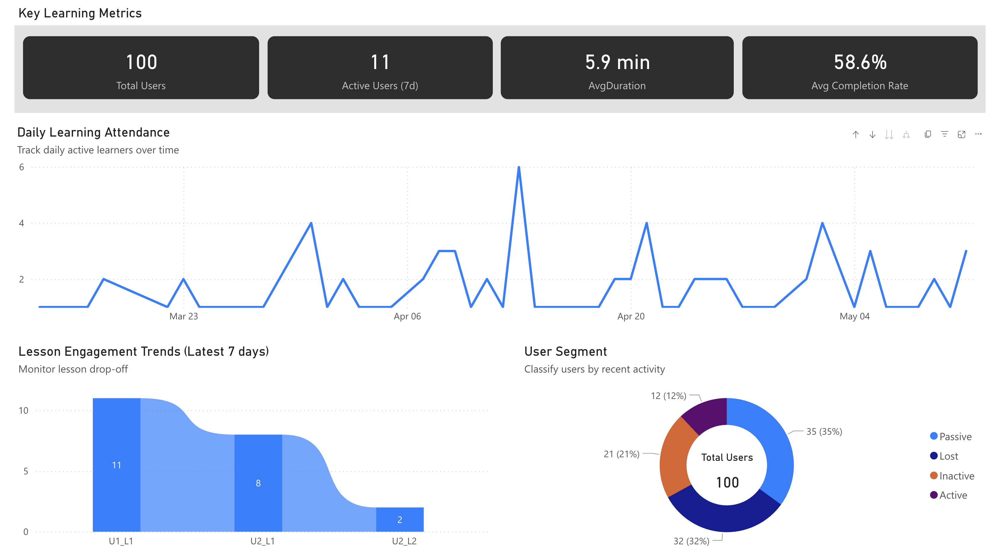
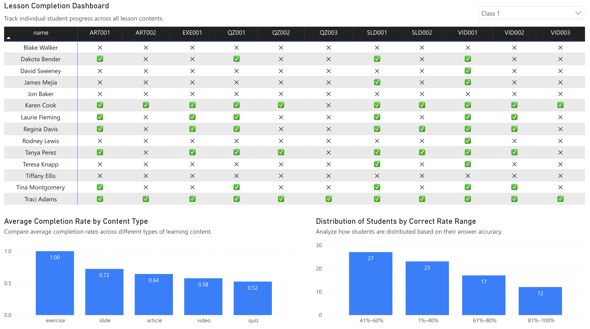
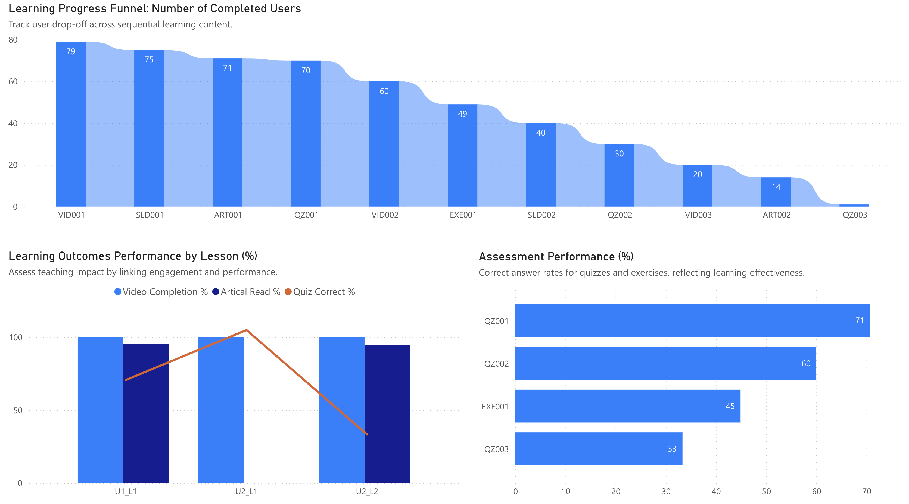
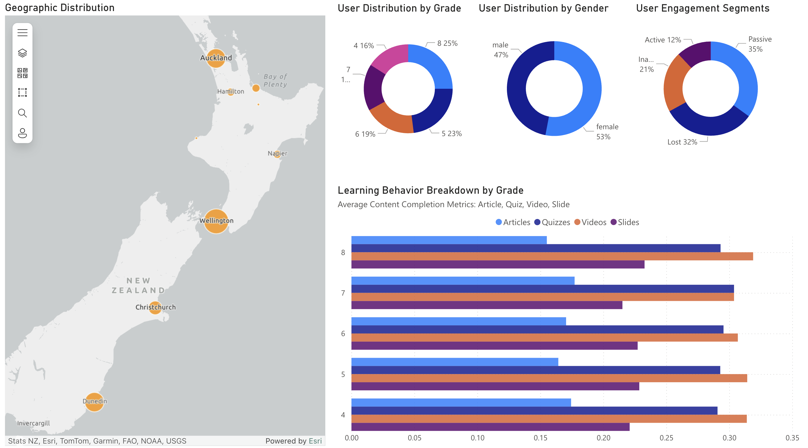

# Power BI Dashboard 

This folder contains the final visualization outputs of the EdTech Analytics pipeline.  
The dashboards were built using Power BI and designed to serve different teams with specific data needs.

## 📊 Dashboard Pages

1. **Overview** – Platform-level KPIs and user engagement summary  
2. **Learning Engagement** – Lesson-level completion and behavioral metrics  
3. **Content Performance** – Content funnel and assessment performance  
4. **User Segmentation** – Demographics and behavior by learner segment

## 🎯 Purpose

The dashboards were designed to:
- Monitor platform usage and behavior in real time  
- Identify drop-off points and learning trends  
- Understand learner segments by behavior and demographics  
- Support data-informed teaching and content decisions

## 🧩 Data Sources

The dashboards are powered by data from two sources:
- **Snowflake models generated via dbt**
- **Original static tables loaded separately** 

## 📊 Dashboard Screenshots

### 1. Overview

---

### 2. Learning Engagement

---

### 3. Content Performance

---

### 4. User Segmentation

